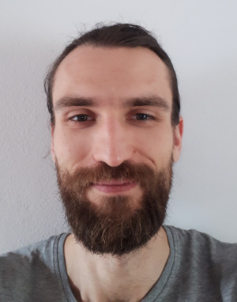

## Witaj na strone Radka 

### O mnie i moich aspiracjach zawodowych

Lubię programować i aktualnie w pracy widzę siebie na stanowisku związanym z **rozwojem oprogramowania**, choć z góry nie odrzucam innych stanowisk, bo życie potrafi mile zaskoczyć.

W akademickich i amatorskich projektach spraktykowałem pisanie kodu w takich językach jak: **C**, **C++**, **Java SE**, **HTML**, **CSS**, a także różnych **językach skryptowych** (np. skrypty powłoki). Pracowałem z **systemami kontroli wersji** (np. **git**).

Ze względu na szerokie zainteresowanie tematem programowania nie mam preferencji, co do konkretnego języka lub technologii. Chciałbym jednak trafić do zespołu, w którym szybko nauczyłbym się **dobrych praktyk programowania** i **współczesnych metodyk** tworzenia i utrzymania kodu.

Jestem **skrupulatny** i lubię zagłębiać się w techniczne niuanse. Preferuję pracę nastawioną na dokładnone wykoanie zadania.

Posiadam praktyczną wiedzę z zakresu **sieci teleinformatycznych i telekomunikacyjnych**. Komercyjne doświadczenie posiadam w zakresie **sieci komórkowych**: zarówno sieci rdzeniowej (**SS7**) jak i dostępu radiowego (**GSM**, **UTMS**, **LTE**), a także **TCP/IP**. Samodzielnie także studiowałem **IEEE 802.11**.

Jestem **Linux** fanem, gdyż lubię wiedzieć co dzieje się „we wnętrznościach” moich maszyn. Prywatnie używam dystrybucji: **Ubuntu**, **Debian**, **ArchLinux**, **LXLE**, a w domowym ruterze trzymam **OpenWrt**.

Bardzo lubię **uczyć się nowych zagadnień** i **poszerzać wiedzę** nie tylko z zakresu nowych technologii. **Nie lubię monotonii**, co sprawia, że chętnie automatyzuję pracę.

Potrafię wczuć się w perspektywę innej osoby, także „nietechnicznej” i wytłmaczyć kwestie techniczne prostym językiem.

Jeśli wymagałoby tego stanowisko pracy z chęcią poszerzyłbym także podstawową wiedzę z zakresu **budownictwa**, **energetyki** lub **elektroniki**.

Staram się również stawać się lepszym człowiekiem i cenię sobie przyjazne towarzystwo z humorem.

Aktualnie zajmuję się także urządzaniem swojego siedliska we wsi Sarniak w woj. lubelskim, więc praca w lubelskim jest preferowaną, ale już wspomniałem, że życie potrafi miło zaskoczyć. :)

### Doświadczenie zawodowe

#### **X.2013 – V.2014** Centrum Wsparcia Teleinformatycznego Sił Zbrojnych
**Technik utrzymania stacji transmisyjnej i komutacyjnej**

- Utrzymanie i rozwiązywanie problemów związanych z sieciami: transmisyjną, telefoniczną, LAN.
- Tworzenie planów rozbudowy sieci teleinformatycznej.

#### **IV.2012 – VIII.2012** Samsung Electronics Polska Sp. z o.o.
**Młodszy Inż. ds. Protokołów**

- Przeprowadzanie testów nowych urządzeń mobilnych
- Reprodukcja i analiza problemów związanych z protokołami radiowymi (UMTS, GSM, GPRS), w tym analiza kodu źródłowego C++
- Współpraca z dostawcami i programistami odpowiedzialnymi za implementację protokołów

Narzędzia: Perforce, Jenkins, Wireshark, analizatory protokołów dostawców.

#### **I.2012 – III.2012** Polkomtel S.A.
**Inżynier ds. Zarządzania Usługami**

Stanowisko podobne do Inżyniera NMC, ale zorientowane bardziej na usługi niż na elementy sieciowe
Dodatkowe obowiązki:
- Ustalanie priorytetów wykonywania zadań na podstawie SLA.
- Tworzenie procedur postępowania dla członków zespołu.

#### **V.2009 – I.2012** Polkomtel S.A.
**Inżynier NMC**

- Monitorowanie usług i elementów sieci komórkowej – GSM, GPRS, UMTS sieć rdzeniowa i dostępowa; usługi dodane (SMS, MMS, VMS, RBT, platforma lokalizacyjna); IN, firewall'e, router'y IP oraz switch'e.
- Rozwiązywanie, koordynacja i eskalacja awarii sieciowych oraz zgłoszeń klientów
- Rekonfiguracja elementów sieciowych
- Szacowanie wpływu awarii i prac planowych na dostępność usług
- Wykonywanie testów z innymi operatorami oraz z klientami
- Tworzenie raportów dla zarządu

Narzędzia: IBM Tivoli, BMC Remedy, narzędzia zarządzania siecią dostarczane przez dostawców sprzętu (CLI oraz GUI), Wireshark, inne analizatory protokołów.

#### **VIII.2008 - IX.2008** Polimex-Mostostal S.A.
**Praktykant**

Na początku moimi obowiązkami było wprowadzanie zmian w rysunkach technicznych, a także inne powtarzające się czynności. W związku z tym szybko napisałem skrypt automatyzujący. Dzięki temu mój przełożony polecił mi zająć się jedynie tworzenie nowych narzędzi automatyzujących. Pisałem makra Excel(VBA), VBScript i AutoCAD script.

### Edukacja

**IX.2005 – VI.2010**  Politechnika Warszawska
Studia inżynierskie
Wydział Elektroniki i Technik Informacyjnych
Kierunek: Telekomunikacja
Specjalność: Systemy i sieci telekomunikacyjne
Ocena końcowa: bardzo dobry

### Inne umiejętności i wiedza

#### Szkolenia

- Nokia Siemens Networks: signalling in cellular core network, MSS, MGW, CS data;
- Szkolenia wewnętrzne Polkomtel S.A.: NSS, GPRS, BSS, VAS, IN, roaming i sygnalizacja.

#### Języki obce
- **Angielski** zdany egzamin na poziomie B2; czytanie książek i dokumentacji technicznej; pisemna i ustna komunikacja ze współpracownikami i dostawcami;
- **Rosyjski** poziom komunikatywny

#### Prawo jazdy
kategorii B

### Projekty hobbystyczne

### Dane kontaktowe i prywatne

Aby odczytać dane musisz mieć moc.
